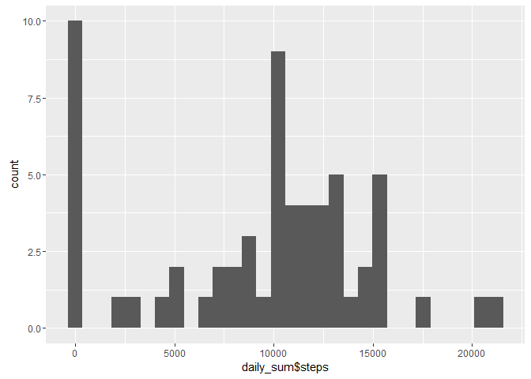
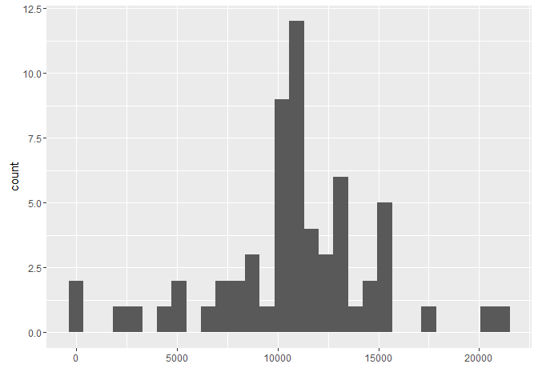
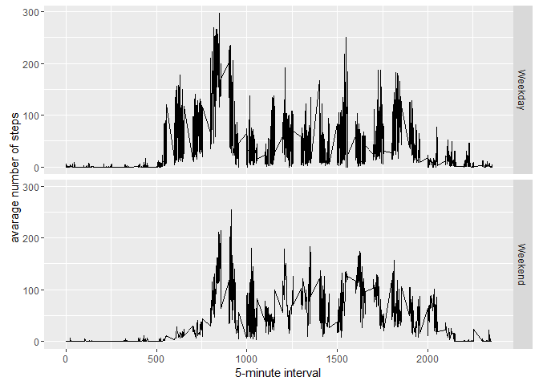

# Reproducible Research: Peer Assessment 1

```r
library(ggplot2)
library(scales)
library(lubridate)
```

```
## 
## Attaching package: 'lubridate'
```

```
## The following object is masked from 'package:base':
## 
##     date
```

## Loading and preprocessing the data

1. Load the data (i.e. read.csv())


```r
activity <- read.csv(file = "./activity.csv", header = TRUE,sep = ",")
```

2. Process/transform the data (if necessary) into a format suitable for your analysis


```r
temp <- activity$interval
temp <- sprintf("%04d", temp)
activity$time <- format(strptime(temp, format="%H%M"), format = "%H:%M")

activity$dayofweek <- weekdays(as.Date(activity$date,"%Y-%m-%d"))
activity$week <- ifelse(activity$dayofweek == "Saturday" | activity$dayofweek == "Sunday", "Weekend", "Weekday")
activity$datetime <- as.POSIXct(paste(activity$date, activity$time), format="%Y-%m-%d %H:%M")
```


## What is mean total number of steps taken per day?

1. Calculate the total number of steps taken per day


```r
daily_sum <- aggregate(activity[, c("steps")], list(activity$date), sum , na.rm=TRUE)
colnames(daily_sum) <- c("date","steps")
head(daily_sum)
```

```
##         date steps
## 1 2012-10-01     0
## 2 2012-10-02   126
## 3 2012-10-03 11352
## 4 2012-10-04 12116
## 5 2012-10-05 13294
## 6 2012-10-06 15420
```

2. If you do not understand the difference between a histogram and a barplot, research the difference between them. Make a histogram of the total number of steps taken each day


```r
daily_step <- ggplot(daily_sum, aes(daily_sum$steps)) + geom_histogram()
daily_step
```

```
## `stat_bin()` using `bins = 30`. Pick better value with `binwidth`.
```

<!-- -->

3. Calculate and report the mean and median of the total number of steps taken per day


```r
meanstep <- mean(daily_sum$steps)
medianstep <- median(daily_sum$steps)
```

The mean of the total number of steps taken daily is : `meanstep`  
The median of the total number of steps taken daily is : `medianstep`

## What is the average daily activity pattern?

1. Make a time series plot (i.e. type = "l") of the 5-minute interval (x-axis) and the average number of steps taken, averaged across all days (y-axis)


```r
interval_average <- aggregate(activity[, c("steps")], list(activity$interval), mean , na.rm=TRUE)
timeseriesplot <- ggplot(interval_average, aes(Group.1, steps)) + geom_line() + xlab("5 minute interval") + ylab("average steps")
```

2. Which 5-minute interval, on average across all the days in the dataset, contains the maximum number of steps?


```r
interval_average[interval_average$steps==max(interval_average$steps),]
```

```
## Warning in max(interval_average$steps): no non-missing arguments to max;
## returning -Inf
```

```
## [1] Group.1 x      
## <0 rows> (or 0-length row.names)
```

```r
head(interval_average)
```

```
##   Group.1         x
## 1       0 1.7169811
## 2       5 0.3396226
## 3      10 0.1320755
## 4      15 0.1509434
## 5      20 0.0754717
## 6      25 2.0943396
```

## Imputing missing values

1. Calculate and report the total number of missing values in the dataset (i.e. the total number of rows with NAs)


```r
nrow(activity) - nrow(na.omit(activity))
```

```
## [1] 2304
```

2. Devise a strategy for filling in all of the missing values in the dataset. The strategy does not need to be sophisticated. For example, you could use the mean/median for that day, or the mean for that 5-minute interval, etc.

The 'NA' values are replaced with 5-minute interval value.

3. Create a new dataset that is equal to the original dataset but with the missing data filled in.


```r
colnames(interval_average) <- c("interval","average_step")
activity_processed<-merge(x = activity, y = interval_average, by = "interval", all.x = TRUE)
activity_processed<-activity_processed[order(as.Date(activity_processed$datetime, format="%d/%m/%Y/%H/%M")),]
activity_processed$steps[is.na(activity_processed$steps)]<-activity_processed$average_step[is.na(activity_processed$steps)]
head(activity_processed)
```

```
##     interval     steps       date  time dayofweek    week
## 1          0 1.7169811 2012-10-01 00:00    Monday Weekday
## 63         5 0.3396226 2012-10-01 00:05    Monday Weekday
## 128       10 0.1320755 2012-10-01 00:10    Monday Weekday
## 205       15 0.1509434 2012-10-01 00:15    Monday Weekday
## 264       20 0.0754717 2012-10-01 00:20    Monday Weekday
## 327       25 2.0943396 2012-10-01 00:25    Monday Weekday
##                datetime average_step
## 1   2012-10-01 00:00:00    1.7169811
## 63  2012-10-01 00:05:00    0.3396226
## 128 2012-10-01 00:10:00    0.1320755
## 205 2012-10-01 00:15:00    0.1509434
## 264 2012-10-01 00:20:00    0.0754717
## 327 2012-10-01 00:25:00    2.0943396
```

4. Make a histogram of the total number of steps taken each day and Calculate and report the mean and median total number of steps taken per day. Do these values differ from the estimates from the first part of the assignment? What is the impact of imputing missing data on the estimates of the total daily number of steps?


```r
new_daily_sum <- aggregate(activity_processed$steps, list(activity_processed$date), sum)
new_daily_step <- ggplot(data=new_daily_sum, aes(new_daily_sum$x)) + geom_histogram() + xlab("")
new_daily_step
```

```
## `stat_bin()` using `bins = 30`. Pick better value with `binwidth`.
```

<!-- -->


```r
new_meanstep <- mean(new_daily_sum$x)
new_medianstep <- median(new_daily_sum$x)
```

The mean of the total number of steps taken daily is : `new_meanstep`
The median of the total number of steps taken daily is : `new_medianstep`

## Are there differences in activity patterns between weekdays and weekends?

1. Create a new factor variable in the dataset with two levels - "weekday" and "weekend" indicating whether a given date is a weekday or weekend day.


```r
activity$dayofweeks <- (as.Date(activity$date,'%Y-%m-%d'))
activity$weeks <- ifelse((toString(activity$dayofweek) == "Saturday" | toString(activity$dayofweek) == "Sunday"), "Weekend", "Weekday")
activity$datetime <- as.POSIXct(paste(activity$date, activity$time), format="%Y-%m-%d %H:%M")
```

2. Make a panel plot containing a time series plot (i.e. type = "l") of the 5-minute interval (x-axis) and the average number of steps taken, averaged across all weekday days or weekend days (y-axis). See the README file in the GitHub repository to see an example of what this plot should look like using simulated data.


```r
new_interval_average <- aggregate(activity_processed$steps, by=list(activity_processed$dayofweek, activity_processed$week, activity_processed$interval), mean)
colnames(new_interval_average) <- c("dayofweek","week","interval","average_step")
ggplot(new_interval_average, aes(interval, average_step)) + geom_line() + facet_grid(week ~ .) + xlab("5-minute interval") + ylab("avarage number of steps")
```

<!-- -->
